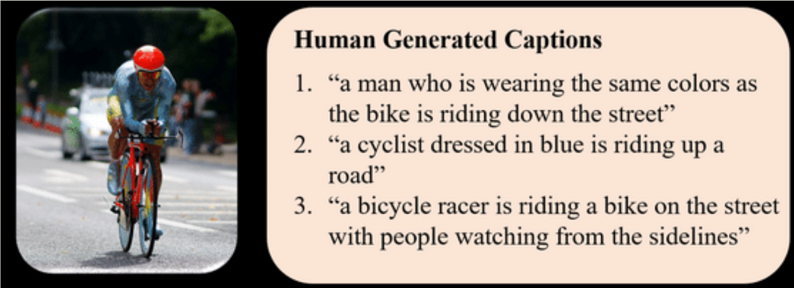
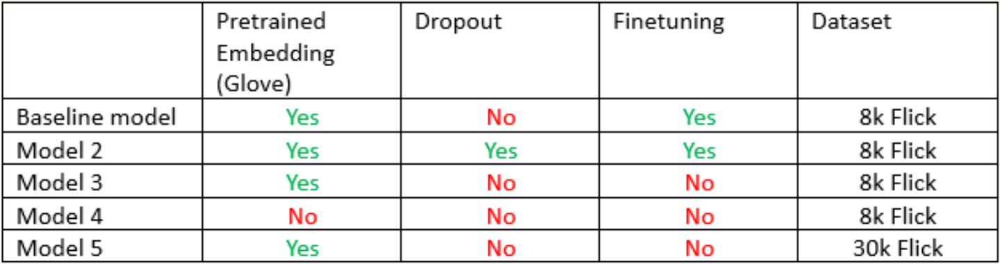

# Image Captioning - Group 2 - UAB Deep Learning Course
Our main proposal for this project is to be able to train an image captioning model based on the [Flickr 8k Dataset on Kaggle](https://www.kaggle.com/datasets/adityajn105/flickr8k), which contains 8,091 images and 5 captions for each image.



*Click on Image to open Kaggle Dataset page:* 

[](https://www.kaggle.com/datasets/adityajn105/flickr8k)


caption_example.png
<br/>

## General Project Structure
Our project is composed by *Python* scripts and notebooks. We made this distinction to make it easy for everyone to diferentiate the already predefined models and methods with the different training runs we did, setting different hyperparameters in order to see differences in results. 

<br/>

## Model architecture
Our model architecture is a combination of an encoder CNN network with a decoder LSTM network of two layers. 

For our CNN encoder we have used the *PyTorch's* pretrained [ResNet-50 model](https://pytorch.org/vision/main/models/generated/torchvision.models.resnet50.html). The softmax from the last layer has been deleted and changed to a fully connected layer that runs through a linear function that feeds the embedding, that afterwards is ran through the first LSTM input.

For our embedding, we have used the 300 dimensions [GloVe pretrained embedding](https://nlp.stanford.edu/projects/glove/). Once the CNN output runs through the embedding, it is sent into the first LSTM cell. To feed the rest of the cells we have used a 100% of teacher forcing, concatenating the image features with the ground-truth words.

<br/>

## How to run the code

> To download and install this repository you can either download the **.zip** on the top of this page or you can install *git* on your PC and run the following command on the location you want the repository to be: `git clone https://github.com/DCC-UAB/dlnn-project_ia-group_2.git`. 

<br/>

In order to replicate the project you will need all the dependencies and libraries that were used to develop the model. On the *environment.yml* file you will find all libraries needed to imitate our model. 

> To install the environment on Anaconda use  `conda env create -f environment.yml`  on the directory where the file is located with the Anaconda console. Change the name of the file if you want to give another name to the environment.

> In order to use that environment, run `conda activate <environment_name>`.

*We will be using PyTorch as our Deep Learning framework, and we highly recommended to use CUDA platform to use the GPU potential in order to train the model.*

<br/>

As external files, you will need:

* The *data* folder, which contains the *Flickr8k* dataset, formed by a folder with 8,091 images, and a **.txt** with 5 captions for each image.
    * In order to run the last model we trained, you will also have to download the [*Flickr30k Dataset on Kaggle*](https://www.kaggle.com/datasets/adityajn105/flickr30k).
* The *GloVe Embedding* folder, which contains the **.pkl** files and the data files in order to train the LSTM decoder with a pretrained embedding.
    * It is recommended to download the data from [the GloVe official site](https://nlp.stanford.edu/projects/glove/). *We will be using the Wikipedia 2014 + Gigaword 5 (6B tokens, 400K vocab, uncased, 50d, 100d, 200d, & 300d vectors, 822 MB):* [glove.6B.zip](https://nlp.stanford.edu/data/glove.6B.zip)

<br/>

## Code Structure
### General files:
* The *README.md* is this file which explains the repository information.
* The *environment.yml* file contains all the python dependencies that are needed to replicate our model experiments and to execute all scripts.
### Folders:
* The *300dim_embdding* is a folder you need to use the pretrained embedding, with the needed files (.pkl, folder....) inside and should be stored outside the repository. This folder can be automatically generated by downlawding the .tx of the embedding and using the *generate_embedding_data.py* we have in our repository.
* The *8k_data* and *30k_data*, with the used datasets inside are also two folder you need to keep outisde the repository.  
* The *model* folder contains *model.py*, which is the described architecture for our CNN to LSTM model.
* The *utils* folder contains all functions that we developed in order to run our whole project. There we can find both metrics and generative functions.
### Main scripts:
* The *get_loader.py* script contains the *Vocabulary* and *Dataset* classes for our own project, with some dependency functions that are used to handle the training.
* The *test.py* script contains the testing function, which will be used to obtain each model's metrics and results.
* The *train_and_val.py* script contains the training and validation functions that will be used to train and evaluate our model during the training phase, no pun intended. It also contains a training function that depicts some images from the training batch and shows the current epoch's caption prediction. 
* The *train_val_test_split.py* script contains a function to split the dataset
* The *generate_embedding_data.py* script automatically creates the needed folder with the needed scripts inside to use the pretrained embedding. You only need to provide the downladed .txt and it will automatically generate the folder. 
* The *training_baseline_model.ipynb* notebook contains the training of our baseline model using the pretrained embedding, aplying finnetuning and using the *model.py* as model, WITHOUT dropout
* The *training_model_2.ipynb* notebook contains the training of another model using the pretrained embedding, aplying finnetuning and using the *model_dropout.py* as model, WITH dropout
* The *training_model_3.ipynb* notebook contains the training of another model using the pretrained embedding, WITHOUT finnetuning and using the the *model.py* as model (the same used in the baseline model).
* The *training_model_4.ipynb* notebook contains the training of another model without using the pretrained embedding and the *model.py* as model (the same used in the baseline model).
* The *training_model_5_3oK.ipynb* notebook contains the training of another model, but in this case using another dataset, the Flick 30k. This dataset is similiar to the Flick 8k but instead of having only 8k images we have 30k images. The model is trained using the petrained embedding, WITHOUT finnetuning (as we observed with the 8k dataset that the qualitative reults where better without using finnnetuning) and using the the *model.py* as model (the same used in the baseline model).

*The definition of each model is described in the following image:*



<br/>

## Further improvements
We have also trained the model with a much wider dataset, this time containing 30,000 images in total, in order to avoid overfitting and have a more general model. To do so, we used the [Flickr30k dataset](https://www.kaggle.com/datasets/eeshawn/flickr30k), which keeps the same structure as the 8k, but with more information. This way, we do not have to focus on adapting the dataset to our own Dataset and Vocabulary classes.

## Example Code
***THIS PART CAN BE OMITTED, YOU CAN CHOOSE***

The given code is a simple CNN example training on the MNIST dataset. It shows how to set up the [Weights & Biases](https://wandb.ai/site)  package to monitor how your network is learning, or not.

Before running the code you have to create a local environment with conda and activate it. The provided [environment.yml](https://github.com/DCC-UAB/XNAP-Project/environment.yml) file has all the required dependencies. Run the following command: ``conda env create --file environment.yml `` to create a conda environment with all the required dependencies and then activate it:
```
conda activate imgcaption
```

To run the example code:
```
python main.py
```
***THIS PART CAN BE OMITTED, YOU CAN CHOOSE***

## Contributors
* **Miguel Moral Hernández - miguel.moral@autonoma.cat**
* **Àlex Sànchez Zurita - alex.sanchezz@autonoma.cat**
* **Pol Medina Arévalo - pol.medina@autonoma.cat**


### ***Neural Networks and Deep Learning Course***

### ***Artificial Intelligence Degree***

### ***UAB 2023***
